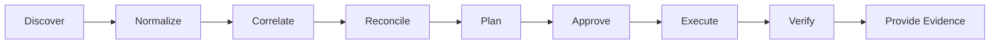
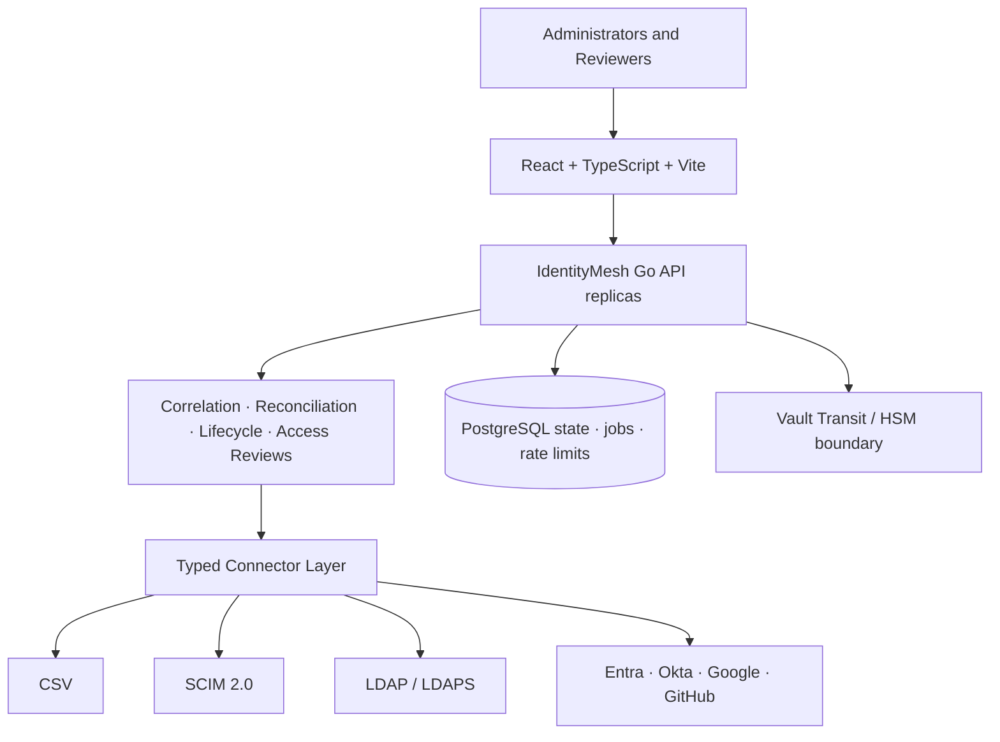
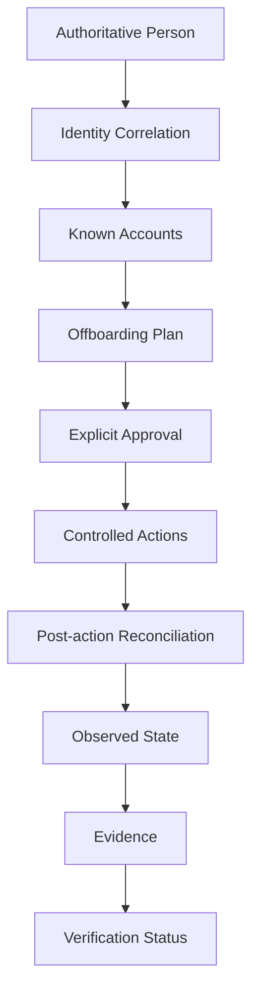

# IdentityMesh

[](https://github.com/thiagomontozo/identitymesh/actions/workflows/ci.yml)
[](https://github.com/thiagomontozo/identitymesh/actions/workflows/codeql.yml)
[](https://github.com/thiagomontozo/identitymesh/actions/workflows/load.yml)
[](https://github.com/thiagomontozo/identitymesh/actions/workflows/release.yml)
[](#production-deployment)
[](LICENSE)
[](https://go.dev/)
[](https://react.dev/)
[](https://www.typescriptlang.org/)
[](https://www.postgresql.org/)
[](https://docs.docker.com/)
[](deploy/kubernetes)

> IdentityMesh correlates identities across connected systems, reconciles access state and verifies whether offboarding actions actually removed known access.

**Current status: Production deployment candidate**

Disabling one account is not the same as proving that a person no longer has access. IdentityMesh answers which digital identities belong to a person, where access remains active, which providers confirmed a change and what evidence supports the conclusion.

> IdentityMesh verifies access within connected and successfully reconciled systems. It cannot prove the absence of accounts or access in systems that are not connected, observable or successfully synchronized.

## Why IdentityMesh?

Provisioning asks whether a disable request was sent. Identity assurance asks whether every relevant known identity was checked, whether its observed state changed, what remains unresolved and whether the evidence is fresh enough to trust. IdentityMesh keeps the human `Person` separate from provider `IdentityAccount` records and never treats a matching display name as sufficient identity evidence.

## Key features

- Tenant-isolated people, identities, access, evidence, audit and administration.
- CSV authoritative source with preview, validation, size/row limits and idempotent apply.
- Generic SCIM 2.0 plus native Microsoft Entra ID, Okta, Google Workspace and GitHub connectors.
- LDAP/LDAPS discovery plus controlled ppolicy/Active Directory disable and membership removal strategies.
- Deterministic correlation, manual candidates, orphan and duplicate-account findings; never name-only auto-link.
- Per-person offboarding plans, explicit approval, durable idempotent actions and provider re-read after writes.
- Honest `VERIFIED`, `PARTIALLY_VERIFIED`, `INCONCLUSIVE` and `FAILED` results with snapshots, evidence and PDF reports.
- Argon2id, revocable cookie sessions, CSRF, RBAC, TOTP and AES-256-GCM or Vault Transit connector secrets.
- PostgreSQL-backed distributed jobs, leases and rate limits for horizontal API replicas.
- Kubernetes profile with non-root containers, probes, disruption budgets, autoscaling and network policy.

## Identity Assurance Model



`VERIFIED` is possible only when all relevant managed identities were reconciled, none remains active, required connectors responded and no blocking correlation uncertainty exists. A provider `200` or `204` response alone is never verification.

## Architecture



IdentityMesh is a modular monolith that can run multiple control-plane replicas. Provider calls occur outside database transactions: local intent is committed, a leased worker performs the typed remote action, the result is persisted, and a new observation establishes evidence.

## Identity Correlation

Exact immutable employee identifiers and exact unique emails in administratively trusted domains are high-confidence signals. Normalized usernames plus consistent attributes may produce medium confidence. Names alone never auto-link; they create reviewable candidates. Confidence is categorical and explained, not a pseudo-scientific score.

## Offboarding Verification



Plans use `DISABLE_ACCOUNT`, `REMOVE_MEMBERSHIP`, `VERIFY_DISABLED` or `MANUAL_REVIEW`. Destructive account deletion and organization-wide bulk disable are intentionally absent.

## Connectors

Implemented connectors are CSV authoritative source, generic SCIM 2.0, LDAP/LDAPS, Microsoft Entra ID, Okta, Google Workspace and GitHub. Every connector declares capabilities and starts with `writeEnabled=false`. LDAP mutation requires an explicit safe strategy; GitHub removes organization membership, while Entra, Okta and Google use native reversible suspension/disable semantics.

Provider access tokens/service credentials are issued and rotated by the operator, encrypted through the selected secret store and never returned to the browser. See [connectors](docs/connectors.md).

## Quick start

1. Copy `.env.example` to `.env` and replace every placeholder with locally generated values.
2. Set a bootstrap administrator password containing at least 12 characters.
3. Run `docker compose up --build`.
4. Open `http://localhost:5173` and sign in with the bootstrap administrator.

Do not reuse development credentials elsewhere. Production requires HTTPS, secure cookies, `DISTRIBUTED` jobs and externally provisioned secrets.

## Docker development

`compose.yml` runs PostgreSQL, the Go API and React frontend; its `demo` profile adds TEST/DEMO-only SCIM providers. `compose.test.yml` runs isolated PostgreSQL, SCIM, OpenLDAP and Vault. No test contacts a real identity system.

## Testing

```text
go test ./backend/...
docker compose -f compose.test.yml up -d --build --wait
go test -tags=integration ./backend/...
docker compose -f compose.test.yml down -v --remove-orphans
./scripts/load.ps1
```

Frontend gates include lint, TypeScript checking, Vitest and production build. The horizontal load gate sends 10,000 authenticated requests through a load balancer to two API replicas and enforces latency and error thresholds. See [testing](docs/testing.md).

## Production deployment

The [Kubernetes profile](deploy/kubernetes) runs three API and two frontend replicas with rolling updates, disruption budgets, HPA, restricted security contexts, probes, TLS ingress and default-deny network policy. PostgreSQL and Vault are external operational dependencies whose HA, backup, restore, monitoring and credentials remain the deployer's responsibility.

Set `IDENTITYMESH_SECRET_PROVIDER=VAULT_TRANSIT` for Vault-managed encryption. When an operator deploys Vault Enterprise with seal wrap backed by an HSM, IdentityMesh never receives the HSM key. This repository does not claim certification of a particular hardware appliance.

## Security

Security invariants include tenant-scoped queries, server-side authorization, fixed connector origins, metadata/link-local blocking, bounded HTTP behavior, write-disabled defaults, explicit approval, idempotency and post-write observation. See the [security model](docs/security-model.md), [threat model](docs/threat-model.md) and [SECURITY.md](SECURITY.md).

## Current limitations

- Systems must be configured; IdentityMesh cannot discover unknown systems.
- No destructive account delete or bulk lifecycle operation.
- Native provider credentials must currently be issued and rotated outside IdentityMesh; embedded OAuth/service-account issuance is not included.
- LDAP writes are restricted to documented ppolicy/Active Directory and membership strategies, not arbitrary LDAP modification.
- Vault/HSM availability, unseal, replication and hardware certification remain operator concerns and were not hardware-lab certified here.
- The repeatable 10,000-request gate is not a substitute for deployment-specific soak, failover and peak-volume testing.
- No compliance, legal-admissibility or complete-visibility certification.

See [limitations](docs/limitations.md).

## Roadmap

- **Delivered foundation:** assurance core, native Entra/Okta/Google/GitHub, controlled LDAP writes, distributed jobs/rate limits, Vault Transit, Kubernetes and load validation.
- **Next:** managed token issuance/rotation, additional SaaS connectors, advanced approvals and delegated administration.
- **Later:** onboarding/role changes, regional runner placement and longer environment-specific performance programs.

## Contributing

Read [CONTRIBUTING.md](CONTRIBUTING.md). Tests must use synthetic identities and providers only.

## License

MIT © 2026 Thiago Montozo. See [LICENSE](LICENSE).
