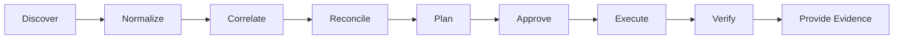
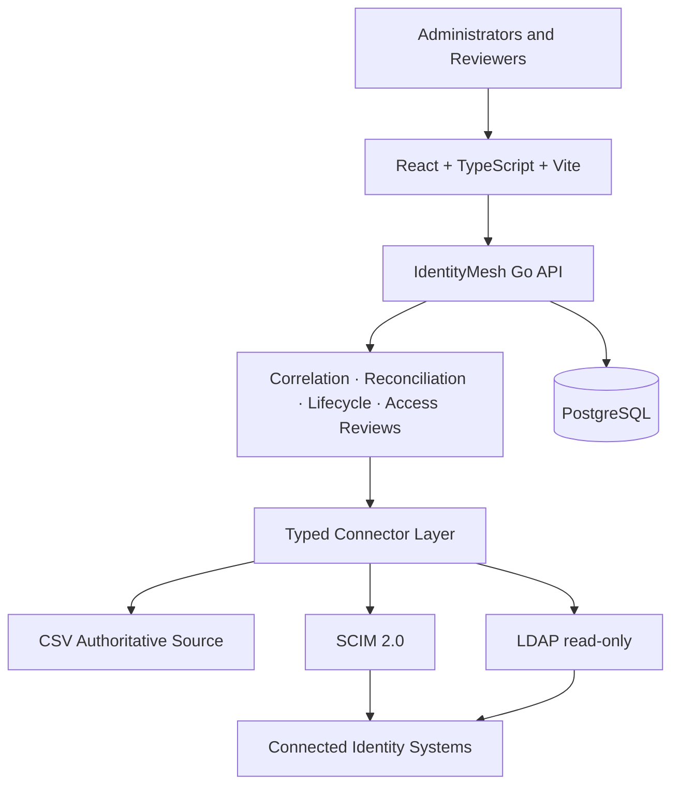
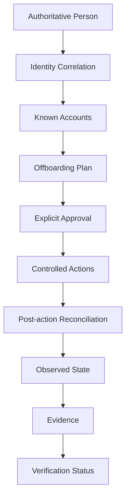

# IdentityMesh

> IdentityMesh correlates identities across connected systems, reconciles access state and verifies whether offboarding actions actually removed known access.

**Current status: Experimental**

Disabling one account is not the same as proving that a person no longer has access. IdentityMesh is an identity lifecycle and access assurance platform built to answer which digital identities belong to a person, where access remains active, which providers confirmed a change, and what evidence supports the conclusion.

> IdentityMesh verifies access within connected and successfully reconciled systems. It cannot prove the absence of accounts or access in systems that are not connected, observable or successfully synchronized.

## Why IdentityMesh?

Provisioning asks whether a disable request was sent. Identity assurance asks whether every relevant known identity was checked, whether its observed state changed, what remains unresolved, and whether the result is fresh enough to trust. IdentityMesh keeps the human `Person` separate from provider `IdentityAccount` records and never treats a matching display name as sufficient identity evidence.

## Key features

- Multi-tenant people and distributed identity account inventory.
- CSV authoritative person source with preview, validation, limits and idempotent keys.
- Generic SCIM 2.0 user/group discovery, pagination and controlled account disable.
- Read-only LDAP user, group and membership discovery.
- Deterministic correlation, manual candidates, orphan and duplicate-account findings.
- Per-person offboarding plans, explicit approval, idempotent actions and bounded execution.
- Provider re-read after writes, honest `VERIFIED`, `PARTIALLY_VERIFIED`, `INCONCLUSIVE` and `FAILED` results.
- Verification snapshots, SHA-256 integrity metadata, audit events and access review decisions.
- Argon2id passwords, server sessions, CSRF protection, RBAC, TOTP foundation and AES-256-GCM connector secrets.

## Identity Assurance Model



`VERIFIED` is possible only when all relevant managed identities were reconciled, none remains active, required connectors responded and no blocking correlation uncertainty exists. A provider `200` or `204` response alone is never verification.

## Architecture



IdentityMesh is a modular monolith. Provider calls occur outside database transactions; local intent is committed first, the remote action is attempted, and a later observation establishes evidence.

## Identity Correlation

Exact immutable employee identifiers and exact unique emails in trusted domains are high-confidence signals. Normalized usernames plus other consistent attributes may produce medium confidence. Names alone never auto-link; they create reviewable candidates. Confidence is categorical and accompanied by human-readable reasons, not a pseudo-scientific score.

## Offboarding Verification



Plans use `DISABLE_ACCOUNT`, `REMOVE_MEMBERSHIP`, `VERIFY_DISABLED`, or `MANUAL_REVIEW`. Destructive account deletion is intentionally absent from v0.1.

## Connectors

The implemented connectors are CSV authoritative source, generic SCIM 2.0 and read-only LDAP. Connectors declare capabilities explicitly and start with `writeEnabled=false`. Entra ID, Okta, Google Workspace, GitHub and other provider-specific integrations are roadmap items only.

## Quick start

1. Copy `.env.example` to `.env` and replace every placeholder with locally generated values.
2. Set a bootstrap administrator password containing at least 12 characters.
3. Run `docker compose up --build`.
4. Open `http://localhost:5173` and sign in with the bootstrap administrator.

Do not reuse development credentials in another environment. Production should provision secrets outside the repository and use HTTPS with secure cookies.

## Docker development

`compose.yml` runs PostgreSQL, the Go API and the React frontend. `compose.test.yml` runs only synthetic PostgreSQL, two TEST/DEMO-only SCIM providers and OpenLDAP. No test contacts a real directory or SaaS tenant.

PowerShell helpers live in `scripts/`. `scripts/integration.ps1` always tears down the test stack and its dedicated volumes.

## Testing

```text
go test ./backend/...
docker compose -f compose.test.yml up -d --build --wait
go test -tags=integration ./backend/...
docker compose -f compose.test.yml down -v --remove-orphans
```

Frontend checks run with `npm ci`, `npm test`, and `npm run build`. See [testing](docs/testing.md) for the synthetic acceptance matrix.

## Security

Security-sensitive invariants include organization-scoped queries, backend authorization, Argon2id password hashing, hashed session tokens, CSRF validation, encrypted connector credentials, fixed connector origins, blocked metadata endpoints, explicit approval and post-write observation. See [security model](docs/security-model.md), [threat model](docs/threat-model.md), and [SECURITY.md](SECURITY.md).

## Current limitations

- Generic SCIM 2.0 is the only writable connector; LDAP is read-only.
- No native Entra ID, Okta, Google Workspace, GitHub or other SaaS connector.
- No automatic discovery of systems that were not configured.
- No destructive account delete or bulk lifecycle operation.
- Single control-plane process, process-local rate limiting and DB-backed bounded workers; no distributed queue.
- Local AES-GCM secret store only; no HSM or managed secret store integration.
- No production-scale load validation or compliance certification.

See [limitations](docs/limitations.md) for scope details.

## Roadmap

- **v0.1 — Identity Assurance Core:** people, CSV, SCIM, LDAP, correlation, reconciliation, offboarding, evidence and basic access reviews.
- **v0.2 — SaaS Ecosystem:** Entra ID, Okta, Google Workspace, GitHub and richer SaaS connectors.
- **v0.3 — Enterprise Lifecycle:** onboarding, role change, distributed runners and advanced approvals.
- **v0.4 — Infrastructure Assurance Integration:** optional NetScope/InfraGraph evidence correlation.

## Contributing

Read [CONTRIBUTING.md](CONTRIBUTING.md). Tests must use synthetic identities and providers only.

## License

MIT © 2026 Thiago Montozo. See [LICENSE](LICENSE).
