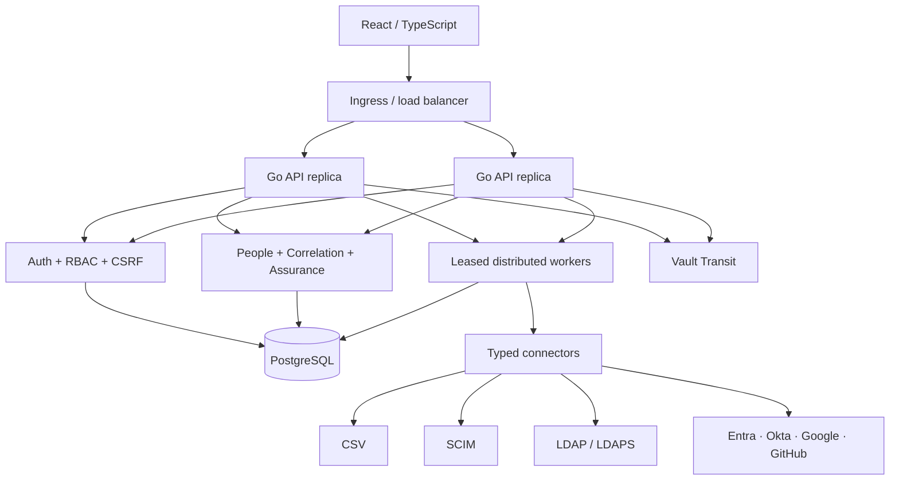
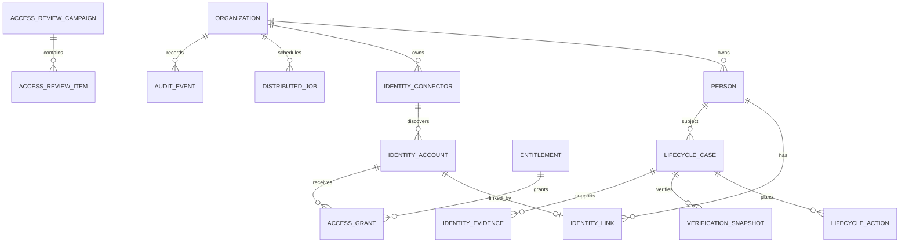

# Architecture

IdentityMesh is a horizontally deployable modular monolith. React is a static web client; interchangeable Go API replicas own authentication and domain APIs; PostgreSQL is the authoritative state, durable job queue, scheduler coordination and distributed rate-limit store. Vault Transit is the external production secret boundary.

Workers claim jobs with `FOR UPDATE SKIP LOCKED`, record a lease owner/expiry, heartbeat while active, retry only within a bounded policy and move exhausted jobs to `DEAD`. Organization plus idempotency key prevents duplicate enqueue. Each replica also has conservative bounded pools, so horizontal scale cannot create unbounded provider calls.

The PostgreSQL fixed-window rate limiter atomically coordinates sensitive-route limits across replicas and hashes client/tenant keys before storage. Trusted proxy headers are honored only for configured proxy CIDRs. The limiter fails closed on its protected operations if PostgreSQL is unavailable.

Remote provider calls never run inside a long database transaction. IdentityMesh persists intent, commits, performs the typed provider call, records the result in a new transaction, reconciles observed state and only then finalizes verification.

