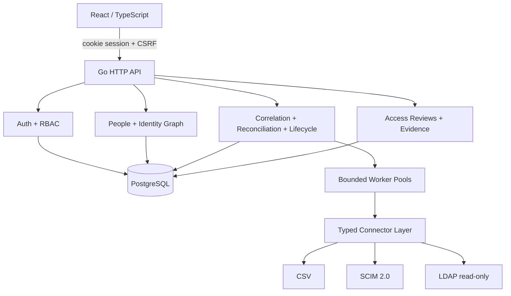
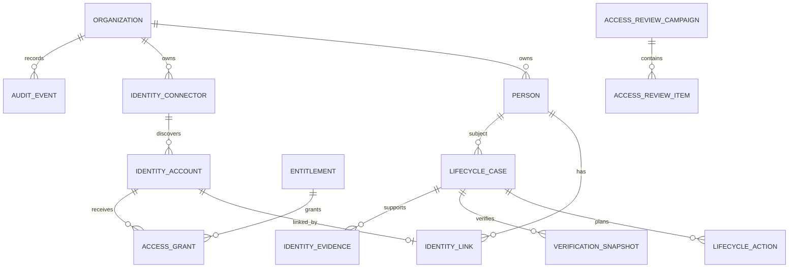

# Architecture

IdentityMesh is a modular monolith: one Go control plane owns HTTP, authentication, scheduling, connector execution and assurance workflows; React is a separate static web client; PostgreSQL is the authoritative local store. Modules communicate through typed Go APIs and durable database records rather than remote service boundaries.

Remote operations never share an ACID transaction with PostgreSQL. IdentityMesh persists intent, commits, performs the provider operation, persists its outcome, reconciles observed state, and only then finalizes verification. Schedulers use PostgreSQL advisory locks so multiple instances do not run the same scheduled task concurrently.

