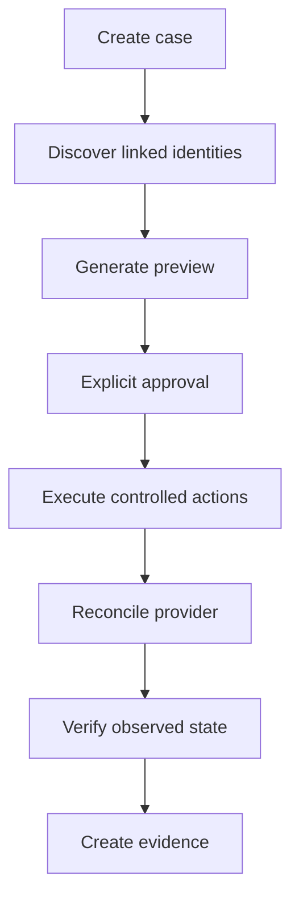

# Offboarding

A plan is centered on one person. Writable SCIM identities with declared capability receive `DISABLE_ACCOUNT`; already-disabled or read-only identities receive `VERIFY_DISABLED`; unsupported/manual systems receive `MANUAL_REVIEW`. v0.1 has no destructive delete and no mass-disable action.
