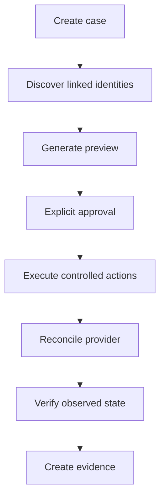

# Offboarding

A plan is centered on one person. Writable SCIM, Entra, Okta, Google and configured LDAP identities with declared capability receive `DISABLE_ACCOUNT`; GitHub can receive `REMOVE_MEMBERSHIP`; already-disabled/read-only identities receive `VERIFY_DISABLED`; unsupported/manual systems receive `MANUAL_REVIEW`. There is no destructive delete or mass-disable action.
